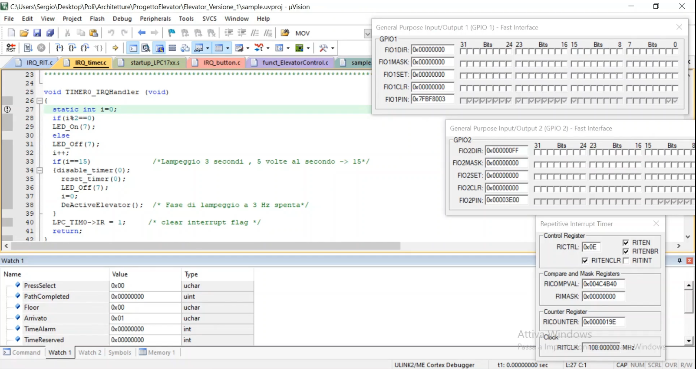

<form class="inline-form" action="/polito-AW1-exams/esame1-noleggio-auto-Sergio235705/delete/master/README.md" accept-charset="UTF-8" method="post"><input type="hidden" name="authenticity_token" value="kmnjXCiDUQHKAl6uw1MHIHbzGclw+bDchsxt7kicdwYfz4Edf4rAgJSVQZIbFoY2vVqViSrOccGPWr/LCQpUcg==" />
            <button class="btn-octicon btn-octicon-danger tooltipped tooltipped-nw" type="submit"
              aria-label="Delete this file" data-disable-with>
              <svg class="octicon octicon-trashcan" viewBox="0 0 16 16" version="1.1" width="16" height="16" aria-hidden="true"><path fill-rule="evenodd" d="M6.5 1.75a.25.25 0 01.25-.25h2.5a.25.25 0 01.25.25V3h-3V1.75zm4.5 0V3h2.25a.75.75 0 010 1.5H2.75a.75.75 0 010-1.5H5V1.75C5 .784 5.784 0 6.75 0h2.5C10.216 0 11 .784 11 1.75zM4.496 6.675a.75.75 0 10-1.492.15l.66 6.6A1.75 1.75 0 005.405 15h5.19c.9 0 1.652-.681 1.741-1.576l.66-6.6a.75.75 0 00-1.492-.149l-.66 6.6a.25.25 0 01-.249.225h-5.19a.25.25 0 01-.249-.225l-.66-6.6z"></path></svg>
            </button>
</form>    

  

      
  

    <article class="markdown-body entry-content container-lg" itemprop="text"><h1><a id="user-content-exam-1-noleggio-auto-29-06-2020" class="anchor" aria-hidden="true" href="#exam-1-noleggio-auto-29-06-2020"><svg class="octicon octicon-link" viewBox="0 0 16 16" version="1.1" width="16" height="16" aria-hidden="true"><path fill-rule="evenodd" d="M7.775 3.275a.75.75 0 001.06 1.06l1.25-1.25a2 2 0 112.83 2.83l-2.5 2.5a2 2 0 01-2.83 0 .75.75 0 00-1.06 1.06 3.5 3.5 0 004.95 0l2.5-2.5a3.5 3.5 0 00-4.95-4.95l-1.25 1.25zm-4.69 9.64a2 2 0 010-2.83l2.5-2.5a2 2 0 012.83 0 .75.75 0 001.06-1.06 3.5 3.5 0 00-4.95 0l-2.5 2.5a3.5 3.5 0 004.95 4.95l1.25-1.25a.75.75 0 00-1.06-1.06l-1.25 1.25a2 2 0 01-2.83 0z"></path></svg></a>IoT: Board LPC elevator for people with poor mobility (uVision Keil simulator + Board LPC1768) 20-12-2019</h1>
<h2><a id="user-content-student-s269486" class="anchor" aria-hidden="true" href="#student-s269486"><svg class="octicon octicon-link" viewBox="0 0 16 16" version="1.1" width="16" height="16" aria-hidden="true"><path fill-rule="evenodd" d="M7.775 3.275a.75.75 0 001.06 1.06l1.25-1.25a2 2 0 112.83 2.83l-2.5 2.5a2 2 0 01-2.83 0 .75.75 0 00-1.06 1.06 3.5 3.5 0 004.95 0l2.5-2.5a3.5 3.5 0 00-4.95-4.95l-1.25 1.25zm-4.69 9.64a2 2 0 010-2.83l2.5-2.5a2 2 0 012.83 0 .75.75 0 001.06-1.06 3.5 3.5 0 00-4.95 0l-2.5 2.5a3.5 3.5 0 004.95 4.95l1.25-1.25a.75.75 0 00-1.06-1.06l-1.25 1.25a2 2 0 01-2.83 0z"></path></svg></a>Student: Sergio Giardina</h2>

